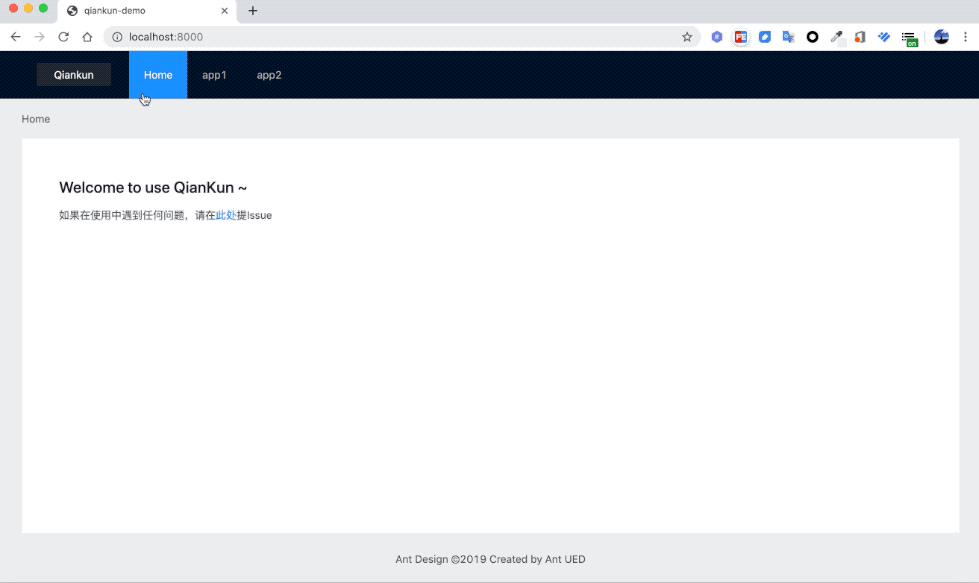

# @umijs/plugin-qiankun

Umi plugin for [qiankun](https://github.com/umijs/qiankun).

[](https://npmjs.org/package/@umijs/plugin-qiankun) [](https://travis-ci.org/umijs/umi-plugin-qiankun) [](https://npmjs.org/package/@umijs/plugin-qiankun)

## Installation

```shell
$ npm i @umijs/plugin-qiankun -S
```

or

```shell
$ yarn add @umijs/plugin-qiankun
```

## Examples

导航是主应用，App1 和 App2 是子应用，



```bash
$ yarn
$ yarn build
$ yarn start
```

## Features

- ✔︎ 基于 qiankun
- ✔︎ 支持主应用和子应用都用 umi
- ✔︎ 支持主子应用 browser、hash 等多种 history 模式
- ✔︎ 父子应用通讯
- ✔︎ 子应用运行时配置自定义 `bootstrap()`、`mount()` 和 `unmount()`
- ✔︎ 主应用、子应用联调

## Usage

### 主应用

#### 构建期

```js
export default {
  plugins: [
    [
      '@umijs/plugin-qiankun/master',
      {
        // 注册子应用信息
        apps: [
          {
            name: 'app1', // 唯一 id
            entry: '//localhost:7001', // html entry
            base: '/app1', // app1 的路由前缀，通过这个前缀判断是否要启动该应用，通常跟子应用的 base 保持一致
            history: 'browser', // 子应用的 history 配置，默认为当前主应用 history 配置
          },
          {
            name: 'app2',
            entry: {
              // TODO 支持 config entry
              scripts: [],
              styles: [],
            },
            base: '/app2',
          },
        ],
        jsSandbox: true, // 是否启用 js 沙箱，默认为 false
        prefetch: true, // 是否启用 prefetch 特性，默认为 true
      },
    ],
  ],
};
```

#### 运行时

```js
export default {
  plugins: [
    ['@umijs/plugin-qiankun/master']
};
```

src/app.js 里配置

```js
// 值是一个 promise
export const qiankun = fetch('/config').then(() => ({
  // 注册子应用信息
  apps: [
    {
      name: 'app1', // 唯一 id
      entry: '//localhost:7001', // html entry
      base: '/app1', // app1 的路由前缀，通过这个前缀判断是否要启动该应用，通常跟子应用的 base 保持一致
      history: 'browser', // 子应用的 history 配置，默认为当前主应用 history 配置
    },
    {
      name: 'app2',
      entry: {
        // TODO 支持 config entry
        scripts: [],
        styles: [],
      },
      base: '/app2',
    },
  ],
  jsSandbox: true, // 是否启用 js 沙箱，默认为 false
  prefetch: true, // 是否启用 prefetch 特性，默认为 true
  lifeCycles: {
    // see https://github.com/umijs/qiankun#registermicroapps
    afterMount: props => {
      console.log(props);
    },
  },
  // ...even more options qiankun start() supported, see https://github.com/umijs/qiankun#start
}));
```

### 配置列表

| 配置 | 说明 | 类型 | 是否必填 | 默认值 |
| --- | --- | --- | --- | --- |
| apps | 子应用配置 | App[] | 是 |  |
| jsSandbox | 是否启用 js 沙箱 | boolean | 否 | false |
| prefetch | 是否启用 prefetch 特性 | boolean | 否 | true |
| defer | 是否异步渲染，比如子应用的 mountElementId 依赖主应用生成的节点，而主应用生成该节点的过程是异步的。<br />当该配置开启的时候，可以使用 `import { qiankunStart } from 'umi'` api 通知 qiankun 启动。参考 [example](https://github.com/umijs/umi-plugin-qiankun/blob/master/examples/master/models/base.js#L35) | boolean | 否 | false |

[qiankun start](https://github.com/umijs/qiankun#start) 方法其他可接收的参数在这里也都可以配置

#### App

| 配置 | 说明 | 类型 | 是否必填 | 默认值 |
| --- | --- | --- | --- | --- |
| name | 子应用唯一 id | string | 是 |  |
| entry | 子应用 html 地址 | string \| { script: string[], styles: [] } | 是 |  |
| base | 子应用路由前缀，通常跟子应用的 [base 配置](https://umijs.org/config/#base) 一致，框架会以这个配置作为前缀判断是否激活当前应用 | string \| string[] | 是 |  |
| history | [umi history mode](https://umijs.org/config/#history) | string | 否 | 主应用 history 配置 |
| mountElementId | 子应用挂载到主应用的哪个 id 节点上（注意不要跟子应用的 mountElementId 一致） | string | 否 | root-subapp |
| props | 主应用传递给子应用的数据 | object | 否 | {} |

### 子应用

配 `@umijs/plugin-qiankun/slave` 插件，

```js
export default {
  base: `/${appName}`, // 子应用的 base，默认为 package.json 中的 name 字段
  plugins: ['@umijs/plugin-qiankun/slave'],
};
```

## 父子应用通讯

1. 约定父应用中在 `src/rootExports.js` 里 export 内容

2. 子应用中通过 `import { useRootExports } from 'umi'; const rootExports = useRootExports();` 取到

## 子应用运行时配置

在子应用的 `src/app.js` 里输出 `qiankun`，`props` 由主应用注册子应用时提供

```js
export const qiankun = {
  // 应用加载之前
  async bootstrap(props) {
    console.log('app1 bootstrap', props);
  },
  // 应用 render 之前触发
  async mount(props) {
    console.log('app1 mount', props);
  },
  // 应用卸载之后触发
  async unmount(props) {
    console.log('app1 unmount', props);
  },
};
```

## Roadmap

- [x] 支持 browserHistory
- [x] 子应用嵌套
- [x] master 运行时配置
- [ ] 公共依赖加载策略
- [x] 子应用单独调试
- [ ] 基于 Hooks 的父子应用通讯（需强制 external React 保证一个 React 实例）

## Questions & Suggestions

Please open an issue [here](https://github.com/umijs/umi/issues?q=is%3Aissue+is%3Aopen+sort%3Aupdated-desc).

## Community

https://github.com/umijs/umi#community

## 相关

- [RFC: 微前端（@umijs/plugin-qiankun） by sorrycc · Pull Request #3 · umijs/rfcs · GitHub](https://github.com/umijs/rfcs/pull/3)

- [umi-example-monorepo](https://github.com/umijs/umi-example-monorepo) 之前尝试的另一种简单粗糙的微前端试验

## LICENSE

MIT
